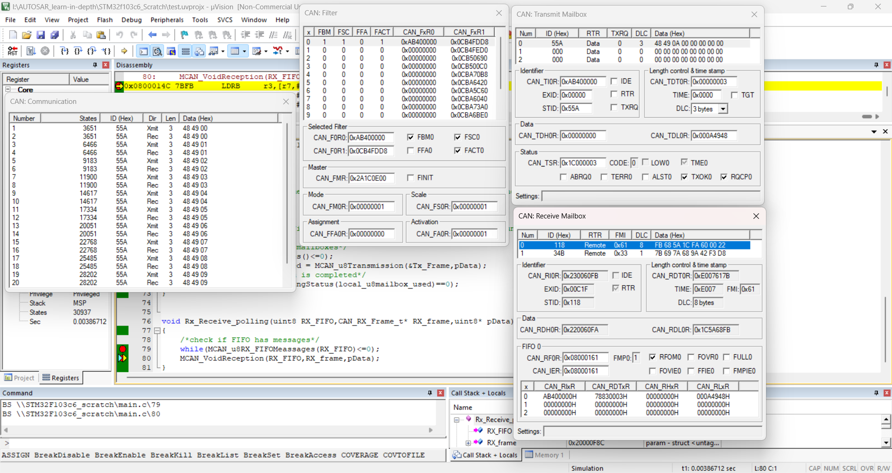

## CAN Project to test CAN Loopback mode
- CAN transmission and reception in polling mode.
- ALL driver,linker script,makefile,startup code used is implemented from scratch.
- project is debugged in Keil microvision
- filter bank used in 32-bit width IDlist mode to filter and accept the same transmitted frame ID.
 