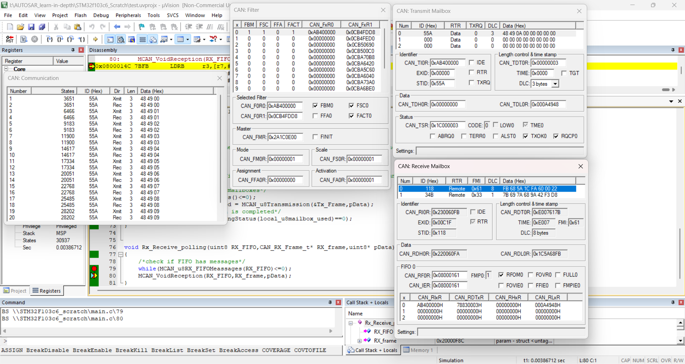
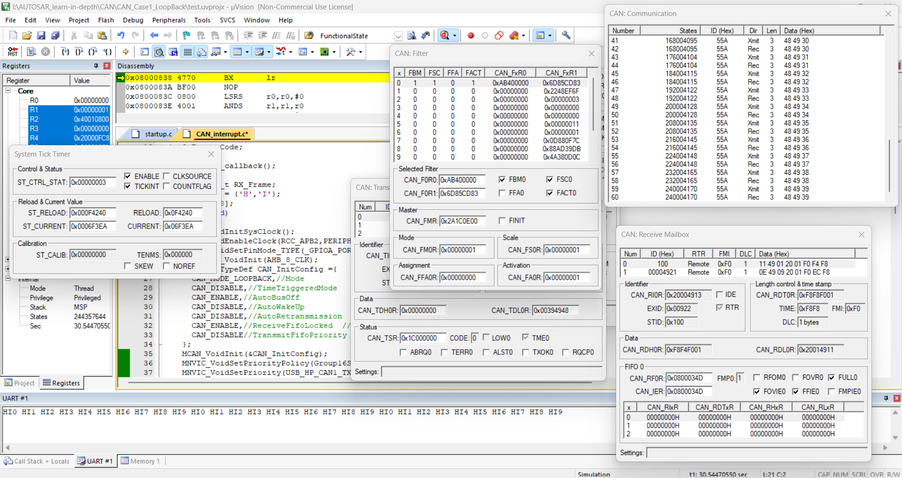

## CAN Project to test CAN Loopback mode in both modes polling and interrupt mode
- CAN transmission and reception in polling mode.
    * transmit data and poll until the request is completed
    * poll until the mailbox receive valid frame (pass one of the filters and has no error) then receive it. 

- CAN transmission and reception in polling mode.
    * transmit data each 1 sec (sysTick interrupt).
    * when interrupt of receiving messages is fire, receive function is run and send it through USART to display it.

- filter bank used in 32-bit width IDlist mode to filter and accept the same transmitted frame ID.
- ALL driver,linker script,makefile,startup code used is implemented from scratch.
- project is debugged in Keil microvision
